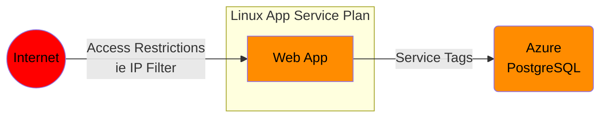
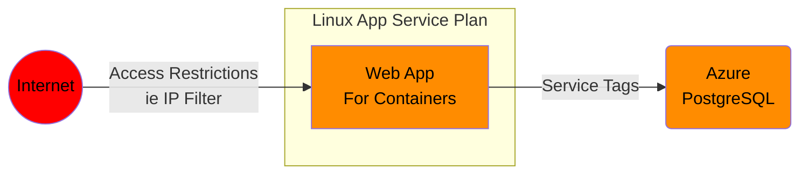
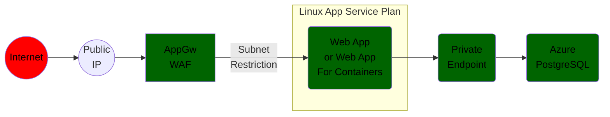

# Azure Java App Linux App Networking

## Some scenarios in order of improved security

### App Services Java App with PostgreSQL (Deploy code)

Code/container deployment:
- From VS Code or VS Studio
- From Azure CLI
- Recommended: Automated CI/CD pipeline (i.e. Git actions/ADO)

Suitable scenarios:
- Dev, Test, POC

### App Services Container Java App with PostgreSQL (Deploy a Docker container)

JAR or WAR Code deployment:
- From VS Code
- From Azure CLI
- Recommended: Automated CI/CD pipeline (i.e. Git actions/ADO)

Suitable scenarios:
- Dev, Test, POC

### AppGW and Private Enpoint App Services App (code or container)

Security at this level:
- Public IP can be protected by DDOS
- TLS by default
- AppGW deployed to subnet and can do SSL offloading
- Traffic flows from internet to the application via Application Gateway
- The application is protected against common attacks via the AppGw WAF
- Traffic flows from App to PostgreSQL via VNET integration, the backend subnet and the PostgreSQL Private Endpoint
- All traffic stays within the Azure backbone

JAR or WAR Code deployment:
- From VS Code
- From Azure CLI
- Recommended: Automated CI/CD pipeline (i.e. Git actions/ADO)

Suitable scenarios:
- QA and production security sensitive workloads

### Front Door Standard App Services Java App (code or containers)

### Front Door Premium App Services

### Azure Container Apps External Java App

### Azure Kubernetes Service External Ingress Java App
