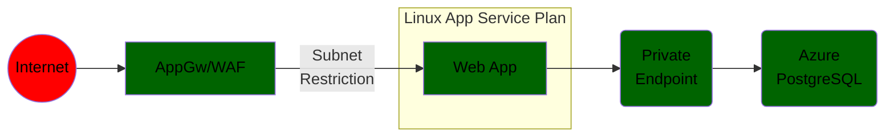

# Azure Java App Linux App Networking

### App Services Java App with PostgreSQL (Deploy code)

JAR or WAR Code deployment:
- From VS Code or VS Studio
- From Azure CLI
- Recommended: Git actions or ADO

Suitable scenarios:
- Dev, Test, POC

### App Services Container Java App with PostgreSQL (Deploy a Docker container)

JAR or WAR Code deployment:
- From VS Code
- From Azure CLI
- Recommended: Git actions or ADO

Suitable scenarios:
- Dev, Test, POC

### AppGW and Private Enpoint App Services App (code or container)

Suitable scenarios:
- Dev, Test, POC

### Front Door Standard App Services Java App (code or containers)

### Front Door Premium App Services

### Azure Container Apps External Java App

### Azure Kubernetes Service External Ingress Java App
